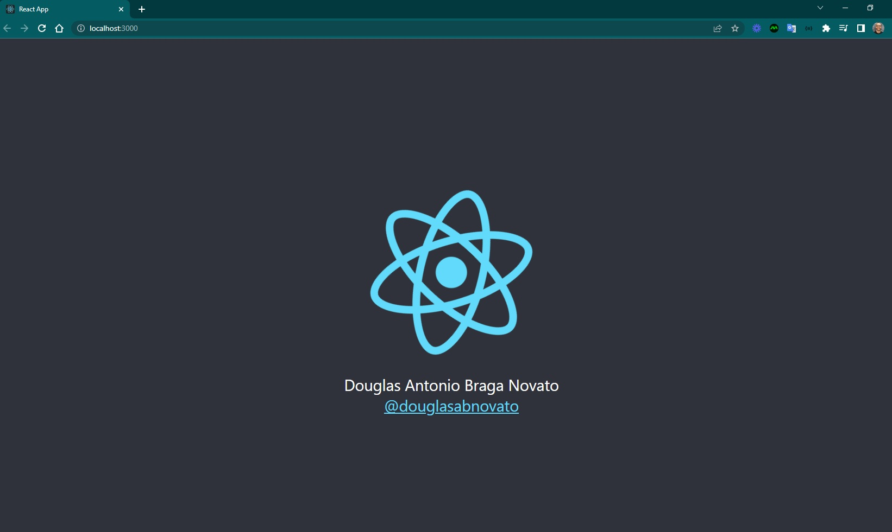
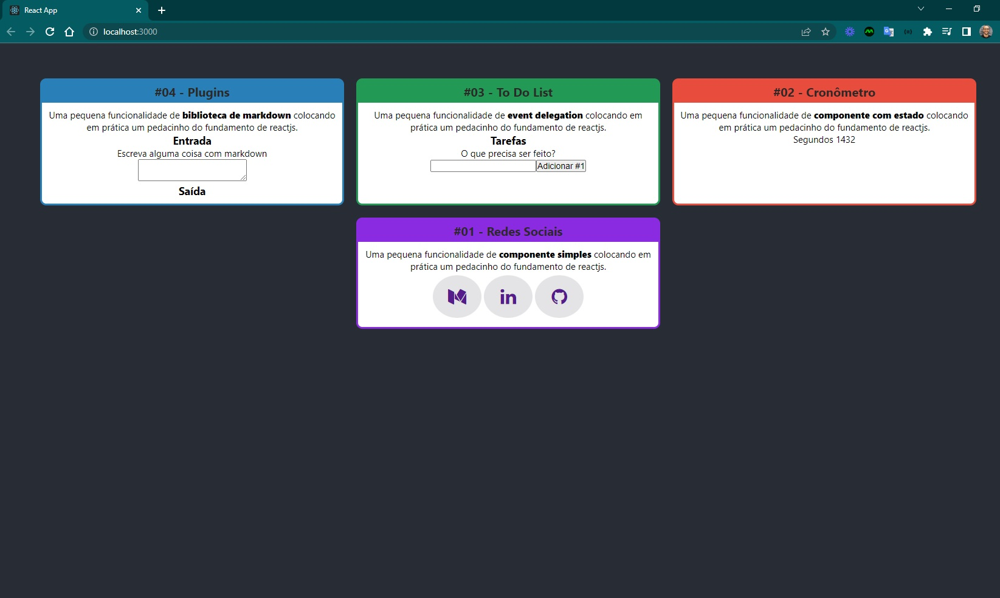
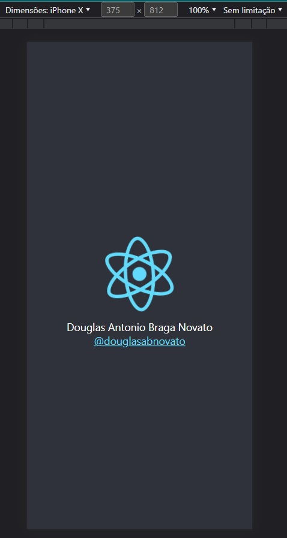

<h4 align="center"> 
	🚧 Voss Coder 🚀
</h4>

  

  

Uma aplicação com funcionalidades demonstrando pílulas de fundamentos em reactjs.

- Criado projeto com [Create React App](https://github.com/facebook/create-react-app).
- Inicializar projeto com `npm start`.
- aberto projeto na porta [http://localhost:3000](http://localhost:3000).
- [Create React App documentation](https://facebook.github.io/create-react-app/docs/getting-started).
- [React documentation](https://reactjs.org/).

## Planejamento

Vamos registrar a maneira como estamos fazendo as coisas nesse projeto.

### Procedimentos

- criar uma branch para desenvolver as tarefas do dia
- criar as issues das tarefas com descrição
- citar as referências consultadas
- abrir pull request para avaliar na branch main

### Branches

- developer-v1.0

### Referências

- [x] [React Home](https://pt-br.reactjs.org/)
- [x] [React Introdução](https://pt-br.reactjs.org/docs/getting-started.html)
- [x] [React Adicionar o React a um site](https://pt-br.reactjs.org/docs/add-react-to-a-website.html)

### Tarefas

- [x] 1. Redes Sociais
- [x] 2. Cronômetro
- [x] 3. Todo List
- [x] 4. Plugins
- [x] 5. Like Buttons

## Versões

- versão 1: desktop - header, main.

  
  

- versão 1: mobile - header, main.

  
  

