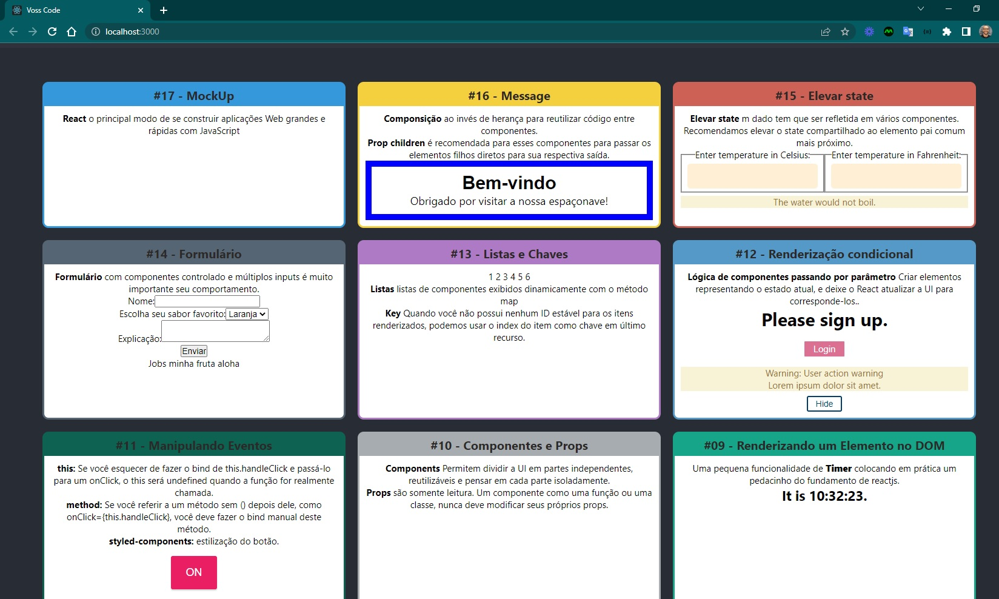
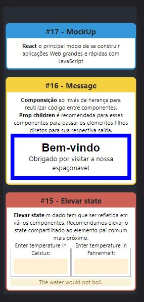

<h4 align="center"> 
	🚧 Voss Coder 🚀
</h4>

  

  

Uma aplicação com funcionalidades demonstrando pílulas de fundamentos em reactjs.

- Criado projeto com [Create React App](https://github.com/facebook/create-react-app).
- Inicializar projeto com `npm start`.
- aberto projeto na porta [http://localhost:3000](http://localhost:3000).
- [Create React App documentation](https://facebook.github.io/create-react-app/docs/getting-started).
- [React documentation](https://reactjs.org/).

## Planejamento

Vamos registrar a maneira como estamos fazendo as coisas nesse projeto.

### Procedimentos

- criar uma branch para desenvolver as tarefas do dia
- criar as issues das tarefas com descrição
- citar as referências consultadas
- abrir pull request para avaliar na branch main

## Branches

- main, developer-v1.0

### Referências da Documentação

- [x] [html color codes](https://htmlcolorcodes.com/)
- [x] [React Home](https://pt-br.reactjs.org/)
- [x] [React Instalação - Introdução](https://pt-br.reactjs.org/docs/getting-started.html)
- [x] [React Instalação - Adicionar o React a um site](https://pt-br.reactjs.org/docs/add-react-to-a-website.html)
- [x] [React Instalação - Crie um novo React App](https://pt-br.reactjs.org/docs/create-a-new-react-app.html)
- [x] [React Instalação - CDN Links](https://pt-br.reactjs.org/docs/cdn-links.html)
- [x] [React Instalação - Canais de Release](https://pt-br.reactjs.org/docs/release-channels.html)
- [x] [React Principais Conceitos - 1. Hello World](https://pt-br.reactjs.org/docs/hello-world.html)
- [x] [React Principais Conceitos - 2. Introduzindo JSX](https://pt-br.reactjs.org/docs/introducing-jsx.html)
- [x] [React Principais Conceitos - 3. Renderizando Elementos](https://pt-br.reactjs.org/docs/rendering-elements.html)
  - [x] [MDN - Uma reintrodução ao JavaScript](https://developer.mozilla.org/pt-BR/docs/Web/JavaScript/Language_Overview)
  - [x] [MDN - Javascript](https://developer.mozilla.org/pt-BR/docs/Web/JavaScript)
  - [x] [The Modern JavaScript Tutorial](https://javascript.info/)
  - [x] [React Tutorial: An Overview and Walkthrough](https://www.taniarascia.com/getting-started-with-react/)
  - [x] [React for Designers](https://reactfordesigners.com/)
  - [x] [Modern JavaScript in React Documentation](https://gist.github.com/gaearon/683e676101005de0add59e8bb345340c)
  - [x] [React, Rethinking best practices - Pete Hunt](https://www.youtube.com/watch?v=x7cQ3mrcKaY)
- [x] [React Principais Conceitos - 4. Componentes e Props](https://pt-br.reactjs.org/docs/components-and-props.html)
- [x] [React Principais Conceitos - 5. State e ciclo de vida](https://pt-br.reactjs.org/docs/state-and-lifecycle.html)
- [x] [React Principais Conceitos - 6. Manipulando eventos](https://pt-br.reactjs.org/docs/handling-events.html)
  - [x] [Styled Components](https://styled-components.com/)
- [x] [React Principais Conceitos - 7. Renderização condicional](https://pt-br.reactjs.org/docs/conditional-rendering.html)
- [x] [React Principais Conceitos - 8. Listas e Chaves](https://pt-br.reactjs.org/docs/lists-and-keys.html)
- [x] [React Principais Conceitos - 9. Formulários](https://pt-br.reactjs.org/docs/forms.html)
- [x] [React Principais Conceitos - 10. Elevar o State - muito importante](https://pt-br.reactjs.org/docs/lifting-state-up.html)
- [x] [React Principais Conceitos - 11. Composição vs Herança](https://pt-br.reactjs.org/docs/composition-vs-inheritance.html)
- [x] [React Principais Conceitos - 12. Pensando do jeito React](https://pt-br.reactjs.org/docs/thinking-in-react.html) 
  - [x] [React Router](https://www.w3schools.com/react/react_router.asp)
  - [x] [Nav Menu Estilizar](https://www.w3schools.com/howto/howto_js_topnav_responsive.asp)
- [ ] [React Guias Avançadas](https://pt-br.reactjs.org/docs/accessibility.html)
- [ ] [React Referência da API](https://pt-br.reactjs.org/docs/react-api.html)
- [ ] [React Hooks - muito importante](https://pt-br.reactjs.org/docs/hooks-intro.html)
- [ ] [React Testando](https://pt-br.reactjs.org/docs/testing.html)
- [ ] [React Como Contribuir](https://pt-br.reactjs.org/docs/how-to-contribute.html)
- [ ] [React FAQ](https://pt-br.reactjs.org/docs/faq-ajax.html)

### Tarefas da Documentação

- [x] 0. Estrutura da página com Card e ListItems
- [x] 1. Redes Sociais
- [x] 2. Cronômetro
- [x] 3. Todo List
- [x] 4. Plugins
- [x] 5. Like Buttons
- [x] 6. Toolchains
- [x] 7. Inicializar Projeto React
- [x] 8. Formatar Nome
- [x] 9. Clock
- [x] 10. Componentes e Props
- [x] 11. Toggle + Styled Components
- [x] 12. LoginControl: Variáveis de Elementos + Evitar renderização
- [x] 13. KeyLists
- [x] 14. FormControlled
- [x] 15. TemperatureCalculator - muito importante
- [x] 16. Message 
- [x] 17. MockUp - muito importante
- [x] 18. Tornar uma página com rota de 0 a 17. Fazer o mesmo para os próximos 
- [x] 19. Estilizar os componentes com styled components
- [x] 20. Estilizar o menu de navegação das rotas

### Versões

- versão 1: desktop - header, main.

  
  
  

- versão 1: mobile - header, main.

  
  
  

## Branches

- developer-v2.0

### Referências do Tutorial

- [ ] [React Tutorial](https://pt-br.reactjs.org/tutorial/tutorial.html)

### Tarefas do Tutorial

- [ ] 0. tarefa

### Versões

- versão 2: desktop - header, main.

  

- versão 2: mobile - header, main.

  

## Branches

- developer-v3.0

### Referências do Blog

- [ ] [React Blog](https://pt-br.reactjs.org/blog/2021/12/17/react-conf-2021-recap.html)

### Tarefas do Blog

- [ ] 0. tarefa

### Versões

- versão 3: desktop - header, main.

  

- versão 3: mobile - header, main.

  

## Branches

- developer-v4.0

### Referências do Comunidade

- [ ] [React Comunidade](https://pt-br.reactjs.org/community/support.html)

### Tarefas do Comunidade

- [ ] 0. tarefa

### Versões

- versão 4: desktop - header, main.

  

- versão 4: mobile - header, main.

  

